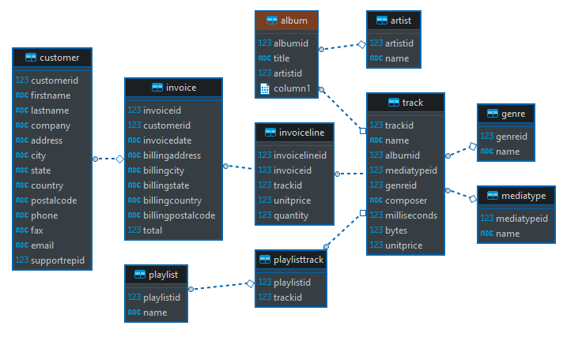

# POSTGRESQL EĞİTİM #2
## CREATE VIEW,İLİŞKİ SORGULAR, EXPORT DATA 

- Aşağıda veritabanı ilişkilerini görüyorsunuz.
- Bu ilişkilerini kullanarak aşağıdaki sorguları csv olarak export almanızı istiyorum.

## SORGULAR

### SORGU 1:  `Let There Be Rock` albümündeki şarkılar

- Çıktıda sadece title ve name olacak.
- İlişkiler id üzerinden kurulacak.
- Kullanılması gereken keywordler `SELECT` , `FROM`, `LEFT JOIN` ve `WHERE`
- Sorgunun sonucunu csv olarak çıktı alınacak.
- [Örnek Sorgu](https://www.postgresqltutorial.com/postgresql-left-join/)
- [Çıktı görmek için tıklayınız!](asset/sorgu1.png)

### SORGU 2:  `AC/DC` albümleri ve şarkıları

- Çıktıda sadece grubun adı grup, album tablosundan gelen title album  ve track tablosundan gelen name kolonu ise sarkı olacak.
- İlişkiler id üzerinden kurulacak.
- Kullanılması gereken keywordler `SELECT` , `AS` ,`FROM`, `LEFT JOIN` ve `WHERE`
- Sorgunun sonucunu csv olarak çıktı alınacak.
- [Çıktı görmek için tıklayınız!](asset/sorgu2.png)

### SORGU 3: Kendiniz en az 3 tablo birleştirerek bir sorgu yazınız.
- En az 3 tablo id üzerinden join yapılacak.
- Kolon isimleri türkçe olarak çıktı alınacak.
- Sadece gerekli kolonlar çıktıya alınacak.
- Oluşturduğunuz sorguyu View olarak kayıt edeceksiniz.
- Oluşturulan tabloya kendi isminiz verebilirsiniz.
- Kullanılması gereken keywordler `CREATE VIEW`, `SELECT` , `AS` ,`FROM`, `LEFT JOIN` ve `WHERE`
- [Creating PostgreSQL Views](https://www.postgresqltutorial.com/managing-postgresql-views/)

